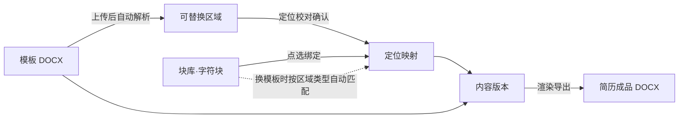
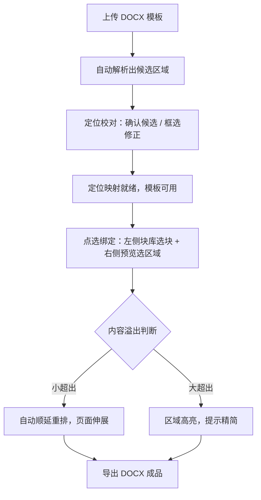

# 简历编辑器产品需求文档

| 项目 | 内容 |
|------|------|
| 文档状态 | 需求定位定稿（基于 2026-09-04 三轮定位对话，画像 v1.0） |
| 产品名称 | 暂定：本地简历编辑器（命名待定） |
| 目标形态 | 本地部署 Web 应用，浏览器在线编辑 |
| 文档读者 | 开发者本人（唯一用户），后续作为开发与验收依据 |

---

## 一、需求背景

### 1.1 需求来源

本需求由产品唯一使用者（开发者本人）提出。使用者处于持续求职与职业沉淀阶段，需要针对不同岗位产出不同侧重的简历版本，且长期看中"内容资产积累"而非"一次性排版"。

### 1.2 使用者痛点

**内容散落多份文件。** 历史简历以多个 Word 文件各自为政，同一段项目经历在不同文件里版本不一，要引用最新表述需要逐个文件翻找，内容的"唯一可信版本"不存在。[用户场景]

**模板迁移成本高。** 看中一个新模板时，现有内容只能重新填一遍。主流在线工具（超级简历、五百丁等）虽然填写体验好，但内容存在平台侧：免费档导出 PDF 带水印、Word 下载单独收费或限制次数（超级简历个人月会员约 19.9 元/月，见 [超级简历资费说明](https://9200.cn/tools/572)；五百丁在线编辑会员与 Word 模板下载权限是分离的两套体系，见 [五百丁官方帮助](http://help.500d.me/help/31.html)）。换平台等于内容重录。

**模板不可自带。** 平台工具只提供自家模板库，用户无法上传自己获得的 DOCX 模板；开源自托管方案 Reactive Resume 支持整套私有部署，但模板体系同样是内置的，不开放任意模板上传（见 [Reactive Resume 官方仓库](https://github.com/AmruthPillai/Reactive-Resume/blob/main/README.md)）。

**直接用 Word 缺少管理层。** Word 排版自由，但没有内容库、没有版本组合、没有替换流程，每次制作都是从零排版。

### 1.3 现有方案对照

调研时间 2026-09，结论如下表：

| 方案 | 模板来源 | 内容归属 | 任意模板上传 | 多版本组合 | 数据本地化 |
|------|----------|----------|--------------|------------|------------|
| 超级简历 / 五百丁等在线平台 | 平台模板库 | 平台侧，导出受限 | 不支持 | 平台内有限支持 | 否 |
| Reactive Resume（开源自托管） | 内置模板体系 | 自托管数据库 | 不支持 | 支持 | 是 |
| 直接使用 Word | 自备 | 本地文件 | 本身即模板 | 无此概念 | 是 |

三个方案各占一角，没有产品同时满足"模板完全自带 + 内容是可复用的个人资产 + 多版本组合 + 数据全本地"——这就是本产品要占住的位置。[PM 判断]

---

## 二、产品定位

### 2.1 一句话定位

跑在个人电脑上的简历内容资产管理器：职业经历长期沉淀为一块块"字符块"内容资产，任何 DOCX 模板上传解析后即可套用，点选组合，生成针对不同岗位的简历版本。

### 2.2 目标用户与典型场景

产品为个人自用，单机单人，无账号与权限体系。三个典型场景按发生频率排序：

**日常沉淀（高频）。** 新完成一个项目或一段经历，随手写成字符块、打上标签入库，与具体投递动作无关，是长期积累行为。

**定向投递（按需）。** 目标岗位 JD 明确后，基于当前模板新建一个内容版本（如"技术侧重版""管理侧重版"），从块库挑块组合绑定，微调后导出 DOCX 投递。

**模板换装（低频）。** 获得一个新模板文件，上传、校对一次定位，已有绑定按区域类型自动迁移到新模板，几分钟产出同样内容、全新样式的简历。

### 2.3 产品形态与运行环境

本地启动一个服务进程，浏览器访问 localhost 完成全部操作。全程无联网依赖，模板解析、内容渲染、文件导出均在本地完成；块库、模板文件、定位映射、版本数据全部存储在本机。

### 2.4 形态决策记录

以下决策来自定位对话，作为产品约束固定下来：

| 决策项 | 结论 |
|--------|------|
| 模板格式 | DOCX 为唯一支持格式（v1） |
| 字符块粒度 | 字段级与片段级混合，统一管理 |
| 块内容格式 | 纯文本，不支持富文本；渲染时继承模板区域原有字体字号 |
| 定位方式 | 自动解析为主，预览图上手动框选修正 |
| 溢出策略 | 分级处理：小超出自动顺延重排，大超出高亮提示精简 |
| 版本能力 | 同一模板多版本并存、随时切换；批量导出归入后续版本 |
| 输出格式 | DOCX 单一格式 |
| 部署形态 | 本地服务 + 浏览器访问 |

---

## 三、术语与概念模型

### 3.1 术语表

| 术语 | 定义 |
|------|------|
| 字符块 | 内容资产的最小单位。字段级（姓名、电话、求职意向）与片段级（一段项目经历）混合，纯文本，带分类与标签 |
| 块库 | 全部字符块的集合，跨模板、跨版本长期复用，是产品的核心资产层 |
| 模板 | 用户自行上传的任意 DOCX 文件，决定简历的版式与样式 |
| 可替换区域 | 模板中被识别或框选出的文本区域，是替换操作的最小目标 |
| 区域类型 | 可替换区域的语义类别（姓名、工作经历等），用于跨模板自动匹配 |
| 定位映射 | 一个模板的可替换区域清单，以及各区域与字符块的绑定关系 |
| 内容版本 | 同一模板下的一套完整绑定组合，多版本并存、可切换 |
| 溢出重排 | 替换内容超出区域容量时，后续区块顺延下移、页面向下伸展的排版行为 |
| 定位校对 | 对自动解析结果进行确认、框选、修正的交互过程 |

### 3.2 概念关系



关键关系有三条：块库独立于模板存在，换模板不换内容；绑定关系归属于内容版本而非模板本身，同一模板可挂多套组合；成品 = 模板样式 + 版本绑定内容的渲染结果。

### 3.3 核心流程



## 四、功能需求详情

### 4.0 界面总览

主编辑界面采用"左侧块库 + 右侧模板预览"的点选式双栏布局，顶部为全局操作区：

```
┌──────────────────────────────────────────────────────────────┐
│ 模板：技术岗模板 ▾   版本：后端侧重版 ▾   [导入模板] [导出DOCX] │
├───────────────────────┬──────────────────────────────────────┤
│  字符块库              │   模板预览 / 定位校对区                │
│ ┌───────────────────┐ │  ┌────────────────────────────────┐  │
│ │ 分类：全部 ▾       │ │  │                                │  │
│ │ 标签：#后端 #项目   │ │  │   （渲染后的模板页面）          │  │
│ ├───────────────────┤ │  │    绿色框 = 已绑定区域          │  │
│ │ ▪ 姓名             │ │  │    黄色框 = 待校对区域          │  │
│ │ ▪ 求职意向          │ │  │    虚线框 = 未识别区域          │  │
│ │ ▪ 项目A·支付重构    │ │  │                                │  │
│ │ ▪ 项目B·风控引擎    │ │  │                                │  │
│ └───────────────────┘ │  └────────────────────────────────┘  │
│ [+ 新建字符块]         │  底部状态条：溢出提示 / 校对模式开关    │
└───────────────────────┴──────────────────────────────────────┘
```

各区域职责：顶部栏承载模板切换、版本切换、导入与导出四个全局动作；左栏是块库的浏览与筛选入口，是内容的来源；右栏承担模板实时预览、绑定点选、定位校对三个职责，是替换操作的目标面；底部状态条集中呈现溢出警示与校对模式状态。左栏选块、右栏选区域，一个绑定动作由两侧各一次点选完成。

### 4.1 字符块库管理

**功能描述。** 用户在左栏通过"新建字符块"按钮或对已有块的编辑入口进入块编辑器，填写名称、内容、分类、标签后保存，块即时出现在库中。块的删除需二次确认；当块正被某个内容版本引用时，删除不连带清空已生成的绑定，而是将相关绑定置为"缺失"状态，生成与导出时对应区域留空并给出提示。库列表按分类分组展示，点选标签可筛选。字符块是长期资产：它不隶属于任何模板和版本，创建一次后可在所有模板、所有版本中反复使用。块内容为纯文本多行输入，保留换行，不支持加粗、颜色等富文本格式；渲染时继承目标区域的字体字号，以此保证成品观感与模板一致。

**字段规则。**

| 字段 | 类型 | 必填 | 约束 | 默认值 |
|------|------|------|------|--------|
| 名称 | 单行文本 | 是 | 2–30 字；重名时提示但不阻止（以内部 ID 区分） | 无 |
| 内容 | 多行文本 | 是 | 上限 [待确认，建议 5000 字]；保留换行 | 无 |
| 分类 | 枚举 + 自定义 | 否 | 预置：基本信息 / 经历 / 技能 / 其他；支持新增自定义分类 | 未分类 |
| 标签 | 多值文本 | 否 | 每块 ≤10 个；标签全局共享、自由创建 | 空 |

**边界与异常。** 空内容不允许保存；标签支持合并与重命名（改一个标签即全库生效）；块内搜索暂不提供，块数量在数百以内的场景下分组加标签筛选够用，搜索列入后续版本。[PM 判断]

### 4.2 模板上传与解析

**功能描述。** 用户点击顶部"导入模板"并选择本地 DOCX 文件后，系统先做格式校验：仅接受 .docx，.doc 提示用户先行转换，加密或损坏文件给出明确报错。校验通过后进入自动解析：扫描文档中的文本区域，按三个层级识别候选可替换区域——模板中已书写的显式占位符（如 `{{姓名}}`）优先级最高；其次匹配常见简历字段名的文本；再次是成段的正文区域。每个候选区域附带置信度，解析完成后模板进入"待校对"状态并自动进入定位校对界面。解析结果持久化：同一模板只需解析一次，后续使用直接载入。v1 的识别范围覆盖正文段落与表格单元格内的文本；页眉页脚、文本框内文字的处理列入开放问题；纯图片、无文本层的模板识别不到任何区域，提示用户此类模板不适用并说明原因。

**模板状态流转。**

| 当前状态 | 允许操作 | 下一状态 | 触发条件 |
|----------|----------|----------|----------|
| 上传中 | 取消 | — | — |
| 解析中 | 等待 | 待校对 | 解析完成 |
| 待校对 | 校对、删除模板 | 可用 | 全部区域处理完毕 |
| 可用 | 编辑绑定、复制、删除 | — | — |

**边界与异常。** 同名模板允许重复导入，以导入时间戳区分并在列表中标注；模板文件被删除时，其定位映射与版本数据保留，重新上传同名文件可恢复关联 [待确认：是否按文件内容指纹关联，更稳妥]。

### 4.3 定位校对

**功能描述。** 这是本产品辨识度最高的交互环节。模板解析完成后自动进入校对模式：右侧预览完整渲染模板，候选区域按置信度着色——高置信绿色、低置信黄色，解析遗漏的位置无框。用户可执行四类操作：点击候选区域予以确认或将其排除；在预览上拖拽框选出遗漏的文本区域，框内文本成为新区域，随后为其命名并指定区域类型；拖动区域边界微调范围；删除多余区域。区域类型是校对的关键产出，枚举为：姓名 / 联系方式 / 求职意向 / 教育经历 / 工作经历 / 项目经历 / 技能清单 / 自我评价 / 自定义。全部区域处理完毕后模板转为"可用"，定位映射随模板持久保存。校对只需做一次：此后新建版本、更换绑定都不再触碰校对，除非模板本身更新后重新导入。

**区域状态流转。**

| 当前状态 | 允许操作 | 下一状态 | 触发条件 |
|----------|----------|----------|----------|
| 候选（自动识别） | 确认 / 排除 / 调整范围 | 已确认 / 已排除 | 用户点选 |
| 新建（手动框选） | 命名 / 指定类型 / 删除 | 已确认 | 用户完成录入 |
| 已确认 | 重新校对 / 删除 | 候选 | 模板重新导入后 |

**边界与异常。** 框选粒度为连续文本区域，不支持跨页框选；误框选导致的空区域在命名环节自动拦截；校对过程中可随时保存进度、中断续作。

### 4.4 内容替换与实时预览

**功能描述。** 模板可用后进入主编辑态。建立绑定的路径有两个方向：正向——用户先在左栏选中一个字符块，再点击右侧预览中的目标区域，绑定即成；反向——先点击预览中某个未绑定区域，弹出块选择列表（按分类分组、可按标签筛选），选中即绑定。绑定完成后预览即时重渲染该区域，替换后的文字继承该区域原有的字体、字号与段落样式，做到预览所见即导出所得。点击已绑定区域可换绑或解绑。绑定关系归属于内容版本：同一模板下，版本 A 与版本 B 可以对同一区域绑不同块，互不干扰。

**边界与异常。** 一个区域在同一版本内只能绑定一个字符块；字段级区域（如姓名）绑定片段级长内容时给出疑似误绑提示，允许强制执行；纯文本中的换行在渲染时保留为换段 [待确认：是否提供"换行映射为软回车"选项，涉及排版密度]。

### 4.5 溢出处理

**功能描述。** 每次绑定与编辑后，系统将替换内容所需的排版空间与区域原容量比较，触发分级处理。小超出（分级阈值 [待确认，建议以超出区域高度 50% 为界]）：执行溢出重排——该区域之后的区块顺延下移、页面向下伸展，行为对齐 Word 本身的自然排版，用户无需干预。大超出：区域以警示色高亮，悬浮提示超出比例，由用户决定精简内容或接受重排结果，系统不擅自截断内容。重排行为在预览与导出中保持一致：预览里看到的伸展效果就是导出文件的真实排版。底部状态条汇总当前版本全部大超出警示，点击可跳转定位到对应区域。

**边界与异常。** 表格内区域的溢出优先令行高自适应，无法在单页容纳时提示用户；跨页重排的页眉页脚继承规则 [待确认]；存在未处理大超出警示时点击导出，先弹出警示清单让用户确认，默认仍执行重排导出 [待确认]。

### 4.6 内容版本管理

**功能描述。** 顶部版本切换器承载版本的全部操作。新建版本时输入版本名（如"后端侧重版"），可选择以当前版本的绑定关系为底稿复制，或从空白开始；各版本的绑定独立维护，切换版本时右侧预览整体刷新为该版本的组合结果。版本服务于"同一模板、不同岗位侧重"的组合管理，配合块库实现"挑内容、不重写"。版本支持重命名与删除；删除当前版本时自动切换至相邻版本；任一模板下至少保留一个版本。批量将全部版本一次性导出（逐个生成文件）列入后续版本，v1 通过逐版本切换加导出覆盖该诉求。

**字段规则。**

| 字段 | 类型 | 必填 | 约束 | 默认值 |
|------|------|------|------|--------|
| 版本名 | 单行文本 | 是 | 2–30 字，同一模板内唯一 | 无 |
| 底稿来源 | 选项 | 否 | 空白 / 复制当前版本 | 复制当前版本 |

### 4.7 换模板沿用

**功能描述。** 用户在顶部切换到新模板（已完成解析校对）时，系统触发绑定迁移：将旧模板中已有的区域-字符块绑定，按区域类型自动匹配到新模板的同类型区域——旧模板的"项目经历"区域绑定自动落到新模板的项目经历区域。迁移结果以清单呈现，分三类：自动匹配成功、多个同类型候选（用户从中点选一个）、无匹配（用户手动指定一次或留空）。手动指定的匹配随新模板的定位映射保存，同一模板只在第一次迁移时付出成本。迁移只搬绑定关系，块库本身不动，内容资产零重录。

**边界与异常。** 区域类型为"自定义"的区域自动匹配命中率低，主要依赖手动指定；新旧模板同类型区域数量不一致时（旧模板 3 段工作经历、新模板只有 2 个区域），多出的绑定进入"无匹配"清单，不自动丢弃；迁移过程可跳过，跳过后新模板从空白版本开始。

### 4.8 导出

**功能描述。** 用户点击顶部"导出 DOCX"，系统以当前模板加当前版本渲染完整文档：所有绑定区域写入块内容并继承模板样式，未绑定区域保留模板原文（方便用户先导出半成品再手工补），溢出重排结果一并落盘。导出前若存在未处理的大超出警示，先展示警示清单由用户确认。产物为单个 DOCX 文件，文件名规则 [待确认，建议"简历-{版本名}-{日期}.docx"]，保存到浏览器下载目录。导出结果与预览的一致性是本功能的验收口径：字体、字号、重排效果三者预览与文件不许有肉眼可见差异。

**边界与异常。** 导出不修改模板与版本数据，可反复导出；本地磁盘写入失败时给出可读报错（非浏览器下载拦截导致的静默失败）。

## 五、版本范围

### 5.1 MVP（v1）必须项

以下能力在第一版全部落地，缺一不可：

| # | 能力 | 对应章节 | 决策来源 |
|---|------|----------|----------|
| 1 | 字符块库：创建 / 编辑 / 删除 / 分类 / 标签 | 4.1 | 定位对话第二轮"长期内容库"+ 第三轮 MVP 筛选 |
| 2 | DOCX 模板上传与自动解析 | 4.2 | 定位对话第一轮 |
| 3 | 定位校对：候选确认 + 手动框选修正 | 4.3 | 定位对话第一轮"自动为主+手动修正"+ 第三轮 MVP 筛选 |
| 4 | 点选替换与实时预览 | 4.4 | 定位对话第三轮"库+预览点选" |
| 5 | 溢出分级处理（自动重排 + 大超出高亮提示） | 4.5 | 定位对话第二轮"分级处理"+ 第三轮 MVP 筛选 |
| 6 | 内容版本：多版本维护与切换 | 4.6 | 定位对话第二轮"多版本切换" |
| 7 | 换模板沿用：按区域类型自动迁移绑定 | 4.7 | 定位对话定稿确认 |
| 8 | 单份 DOCX 导出 | 4.8 | 定位对话第二轮"DOCX 就够" |

### 5.2 后续版本

以下能力明确不在 v1，按优先级排列：

| # | 能力 | 说明 |
|---|------|------|
| 1 | 批量导出 | 一键导出某模板下全部版本 |
| 2 | 块内搜索 | 块库规模超过数百后提供全文检索 |
| 3 | PDF 输出 | DOCX 转换链路，v1 明确不做 |
| 4 | 简单富文本块 | 加粗、项目符号列表 |
| 5 | 数据备份与迁移 | 全量数据导出为文件，便于换机 |
| 6 | 云同步 / 多人协作 / 平台模板库 | 与"个人本地工具"定位冲突，长期不做 |

---

## 六、约束与非功能需求

**数据本地化。** 块库、模板、定位映射、版本数据全部存储在本机，产品运行不依赖任何网络服务；除用户主动导出外，数据不出本机。这是定位的根基，任何功能的实现方式都不许突破。

**样式一致性。** 成品与模板的样式一致是本产品的立身之本：替换文字继承区域原有字体字号，导出文件与预览渲染不许有肉眼可见差异。该口径同时约束 4.4 与 4.8 两个环节。

**响应基线。** [待确认，PM 建议] 绑定后的预览局部刷新 ≤1 秒；10 页以内模板的解析 ≤5 秒；超出基线时给进度反馈而非无响应等待。

**运行环境。** 主流桌面操作系统可运行；现代浏览器（Chrome / Edge / Firefox 近两年版本）可访问；无需安装数据库等外部依赖，开箱即用。

---

## 七、开放问题

开发启动前需要逐一敲定的遗留项，按影响面排序：

| # | 问题 | 位置 | 建议方向 |
|---|------|------|----------|
| 1 | 无占位符模板的自动解析策略细则（字段名匹配的词表、成段区域的切分规则） | 4.2 | 先支持 `{{字段名}}` 占位符约定保证确定性，无占位符模板依赖校对兜底 |
| 2 | 溢出分级阈值 | 4.5 | 以超出区域高度 50% 为界，开发中实测调整 |
| 3 | 大超出未处理时导出的默认行为 | 4.5 / 4.8 | 默认重排导出 + 弹窗确认 |
| 4 | 页眉页脚、文本框内文字是否纳入 v1 可替换范围 | 4.2 | 倾向 v1 不支持，校对界面明确标注不可选 |
| 5 | 同类型多区域跨模板迁移的匹配规则 | 4.7 | 按文档中出现顺序匹配，多出部分进"无匹配"清单 |
| 6 | 块内容长度上限 | 4.1 | 5000 字 |
| 7 | 换行渲染策略（换段 vs 软回车） | 4.4 | 提供选项，默认换段 |
| 8 | 模板重新上传的关联方式 | 4.2 | 按内容指纹关联 |
| 9 | 产品命名 | 全文 | 开发启动前定 |

---

*本文档基于 2026-09-04 三轮需求定位对话定稿，画像版本 v1.0；文中[待确认]项敲定后升版为 v1.1。*
