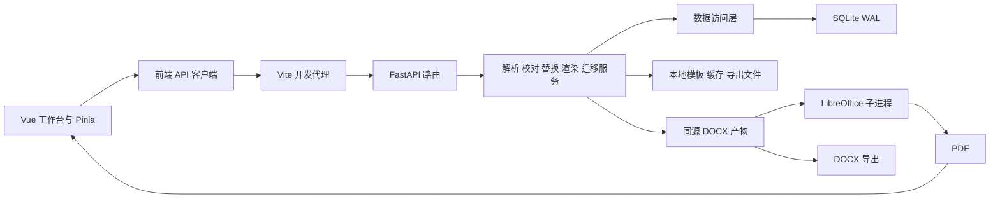

# 当前架构总览

状态：Existing。以仓库 `fdc8dbe` 为架构基线，补充 M12 的已实现前端交互，更新日期 2026-10-08。本文描述已有架构；下一阶段安排见 [下期规划](../product/NEXT_PLAN.md)，现行约束见 [AGENTS](../../AGENTS.md)。

## 组件与目录

Vite `/api` 代理是现有开发启动方式的一部分，不代表生产部署架构。后端绑定 `127.0.0.1:8740`，前端开发端口 5173。

| 目录 | 现有职责 |
|------|----------|
| [backend/app/api](../../backend/app/api/) | 请求模型、路由、输入校验和响应 |
| [backend/app/services](../../backend/app/services/) | 模板解析、替换、渲染几何、溢出、校对、迁移与导出 |
| [backend/app/models](../../backend/app/models/) | 实体、七表 schema、连接/事务及 repositories |
| [backend/app/core](../../backend/app/core/) | 路径/服务设置、领域常量和统一错误处理 |
| [frontend/src/api](../../frontend/src/api/) | API 请求与响应处理 |
| [frontend/src/stores](../../frontend/src/stores/) | 工作台、块库和预览状态 |
| [frontend/src/components](../../frontend/src/components/) | 块库、模板预览、校对、版本与导出交互 |
| [frontend/src/composables](../../frontend/src/composables/) | 共享弹层键盘与焦点生命周期 |
| [frontend/src/pdf](../../frontend/src/pdf/) | pdfjs 渲染及坐标换算 |

六类弹层使用原生 `dialog.showModal()` 进入浏览器顶层并隔离背景，遮罩覆盖全窗。[useModalEsc](../../frontend/src/composables/useModalEsc.ts) 统一处理 Esc、Tab 循环、动态内容的焦点保留及关闭后归还焦点；迁移关闭沿用跳过语义。块库分隔条支持鼠标和左右键调宽，沿用现有 store 的边界与持久化。

## 内容资产和持久化

[schema.py](../../backend/app/models/schema.py) 定义 `blocks / tags / block_tags / templates / regions / versions / bindings`。

- 块是独立于模板的多行纯文本资产，通过标签组织；删除采用软删除。
- 模板保存原文件路径、SHA-256 指纹和解析/校对状态；同内容重传关联已有模板。
- 区域属于模板，文档流 anchor 承担定位身份，bbox 供页面展示和测量。
- 版本属于模板；一个版本的一个区域至多绑定一个块，同一块可被多个区域或版本引用。
- 被引用块软删除后，相关绑定进入 missing 状态；渲染与导出按现行降级规则处理。
- 渲染读取当前块内容；当前没有独立的历史内容快照模型。内容更新与跨期冻结的产品规则仍需明确。

[db.py](../../backend/app/models/db.py) 开启 WAL 与外键。一次 `get_conn()` 范围内的写入统一提交，异常回滚，repositories 不自行提交。现有迁移是幂等的轻量补列/删列，没有单独的版本化迁移框架。

## 模板、替换与渲染

1. [模板服务](../../backend/app/services/template_service.py) 校验、指纹关联、保存原件，编排候选解析和默认版本创建。
2. [解析器](../../backend/app/services/docx_parser.py) 遍历正文和表格内段落，按占位符、词表、成段正文产生候选；页眉页脚和文本框不是 v1 可替换范围。
3. [校对服务](../../backend/app/services/proofread_service.py) 处理候选、框选、微调和区域状态，逐操作落库。
4. [替换引擎](../../backend/app/services/replacement.py) 定位文档流元素，替换占位符片段或整段内容；跨 run 占位符、多行克隆、样式继承和路径重算已有处理。
5. [渲染编排](../../backend/app/services/render_service.py) 使用同一 DOCX 产物转换 PDF，并计算几何/溢出；[导出服务](../../backend/app/services/export_service.py) 保存同源 DOCX 和处理警示。

现有占位符支持段内替换；无占位符区域走整段替换路径。预览上的 bbox 框选并不等同于实现任意字符区间替换，这属于后续需要核对的能力边界。

[LibreOfficeManager](../../backend/app/services/libreoffice.py) 使用串行锁、独立 profile、超时回收和内容 SHA-256 缓存。替换后的 DOCX 序列化归一 ZIP 时间戳，保证未变内容可命中缓存。版本预览并非已实现真正的页级增量刷新；M24 仍在规划。

自动 bbox 依据来源 PDF 指纹失效重算，人工 bbox 保护不覆盖。PDF 内容流顺序不能直接视为阅读顺序。相关陷阱见 [P1—P27](../development/KNOWN_ISSUES.md)。

## 接口与数据目录

请求/响应模型以 [API 路由源码](../../backend/app/api/) 为准。服务运行后可通过内部 `/docs` 查看 FastAPI 生成的接口说明；本文件不复制全部字段。

- 块与标签：`/api/blocks`、`/api/tags`。
- 模板及区域：`/api/templates`、`/api/templates/{id}/regions`、`/api/regions/{id}`。
- 版本与绑定：`/api/templates/{id}/versions`、`/api/versions/{id}/bindings`。
- 渲染与导出：模板/版本 preview、版本 overlay 和 export。
- 跨模板迁移：模板 migrate/plan 与 migrate/apply；按类型及顺序匹配，custom 需人工选择。

[config.py](../../backend/app/core/config.py) 将运行数据锚定项目根 `data/`，含 SQLite、模板、缓存、导出、字体配置和 LO profile。它们已被 Git 忽略，备份和迁移时需保留用户数据。运行方式及目录说明见 [README](../../README.md)。

## 平台与后续边界

仓库启动、安装提示和应用字体配置主要按 macOS 编写。此前云环境使用仓库外的 Linux 字体 wrapper 验证过转换；这不是已进入源码的跨平台实现。Node 精确要求以 [锁文件](../../frontend/package-lock.json)和包 engines 为准，README 的早期“18+”不能覆盖实际依赖要求。

当前尚未实现结构化块、计算窗口、AI、全局撤销或动态表格。本文随实际实现更新，未开发能力不作为已有架构描述。
